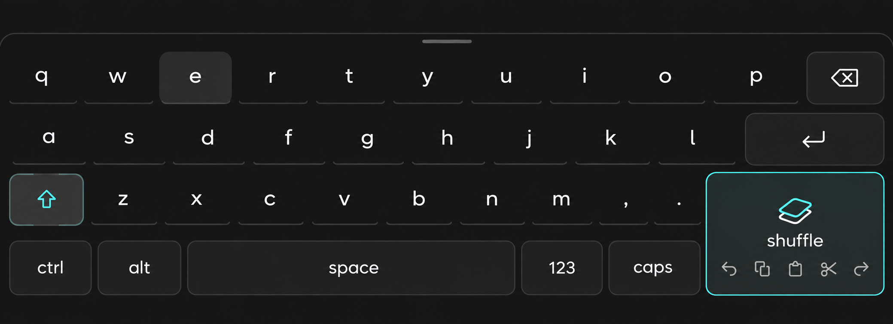

# Shuffle Keyboard product contract

**Status:** Required for Shuffle 1.0; technical evaluation queued.

Shuffle Keyboard provides reliable text input and precision desktop control on a
supported 10–13 inch touch device without physical peripherals. KDE/KWin or another
mature system input-method stack owns delivery, locale, keymaps, and application
compatibility. Shuffle owns layout, interaction, sizing, and presentation.

## Base keyboard

- Four landscape rows with large, generously spaced touch targets.
- Conventional QWERTY positioning without a permanent number row or arrow cluster.
- `123` switches the character area to numbers and symbols.
- Space is reachable from either hand; Shift, Ctrl, and Alt remain available without
  crowding primary text input.
- Secondary desktop keys may use a layer rather than permanent width.

The right edge contains three cascading targets integrated into the silhouette:

- Backspace: 1×.
- Enter: 1.5×.
- Shuffle: 2× and the primary mode transition.

## Edit gesture surface

The space beside the cascading keys is a short-range editing surface, not a pointer
trackpad. The prototype vocabulary is:

| Gesture | Action |
| --- | --- |
| Two-finger tap | Copy |
| Three-finger tap | Cut |
| Hold | Paste |
| Swipe left | Undo |
| Swipe right | Redo |

Gestures need immediate feedback, generous tolerance, and no pointer or scroll side
effects. Exact mappings remain subject to accidental-trigger testing, especially Cut.

## Shuffle transition and precision surface

Holding Shuffle should temporarily replace the keyboard region with a full-footprint
precision surface and restore the keyboard on release. Tapping Shuffle may latch the
surface for longer work.

Baseline precision behavior:

| Gesture | Action |
| --- | --- |
| One-finger move | Pointer movement |
| One-finger tap | Primary click |
| One-finger hold/drag | Drag or selection |
| Two-finger move | Scroll |
| Two-finger tap | Secondary click |

The precision surface does not duplicate system-level Shuffle gestures. Editing
gestures remain a separate recognizer and state.

## Dynamic height

The upper keyboard edge is directly draggable between safe minimum and maximum
heights. The chosen height persists. Landscape and portrait may eventually remember
separate values. Workspace reservation must update correctly as the height changes.

## Visual contract

Use the shared Shuffle visual language: dark, restrained, minimal chrome, clear
spacing, and subtle boundaries. Avoid skeuomorphic keys, dense outlines, permanent
toolbars, and ornamental technical styling. The cascading action geometry is part of
the recognizable keyboard silhouette.

### Accepted visual direction

The September 17 concept establishes the direction without serving as a pixel-level
layout specification:

- Retain MaiN Keyboard's open spacing, floating labels, and quiet lower key edges.
- Use the shared dark surfaces, Ghost White labels, rounded controls, restrained
  borders, and accent only for meaningful state.
- Backspace is one ordinary-key width. Enter is approximately 1.5 key widths.
- Shuffle is a two-key-wide surface spanning two rows at the lower-right corner.
- Shuffle behaves as a small text-edit gesture surface. Its gesture hints are quiet
  guidance, not five separate buttons.
- The bottom control order is `ctrl`, `alt`, `space`, `shift`, `123`, then Shuffle.
- Shift sits immediately right of Space. It is visually neutral until active and
  must not read as a second Caps Lock.
- The pictured `caps` label is superseded by `shift`; do not implement duplicate
  Shift or Caps controls from the reference image.

## Engineering constraints

- Evaluate Plasma Keyboard, Qt Virtual Keyboard, KWin input-method plumbing, and
  Fcitx5 OSK before choosing an implementation base.
- Do not build a custom input engine unless mature system infrastructure cannot meet
  the release contract.
- Verify Qt/KDE, GTK, browsers, Chromium/Electron, and terminals.
- Treat dropped characters, wrong keymaps, focus loss, meaningful latency, unreliable
  show/hide, or incorrect workspace reservation as blockers.
- Keep pointer, editing, resize, keyboard, and system gestures in explicit,
  non-overlapping ownership states.
- Lock-screen/session surfaces are supported only where the system API permits safe
  integration.

## 1.0 boundaries

Shuffle 1.0 does not independently implement autocorrect, prediction, swipe typing,
dictation, custom dictionaries, AI writing, a multilingual IME, or emoji
infrastructure. Mature system-provided capability may be integrated when it does not
compromise input reliability.

## Acceptance

A supported touch device can type quickly without loss or incorrect mapping, change
keyboard height, enter and leave the precision surface without focus loss, perform
pointer and editing actions reliably, and return immediately to text input.
